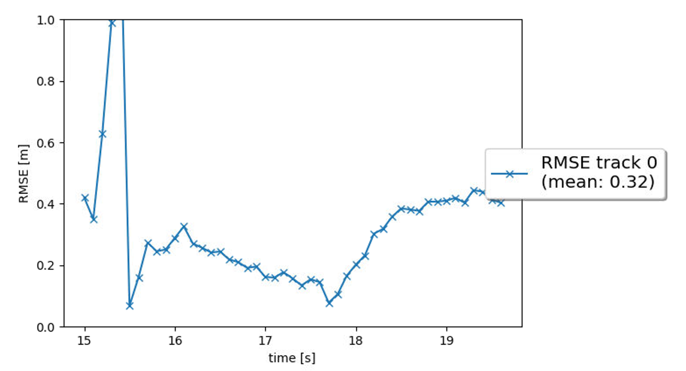
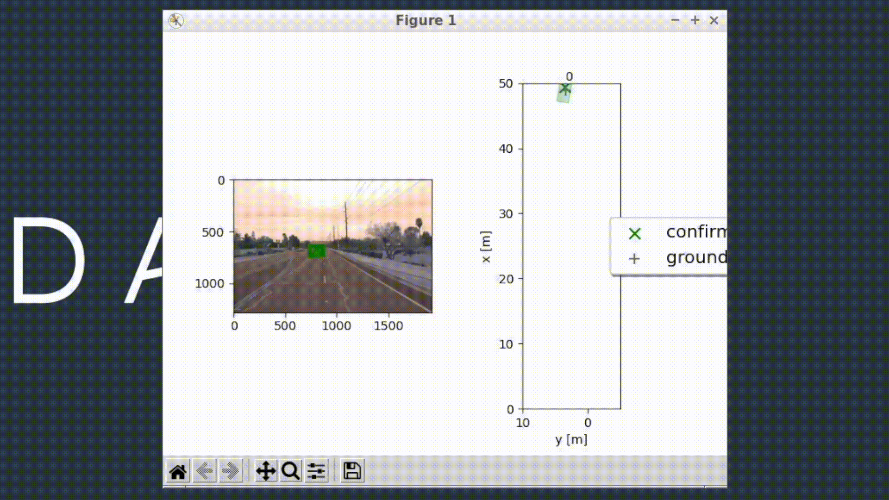
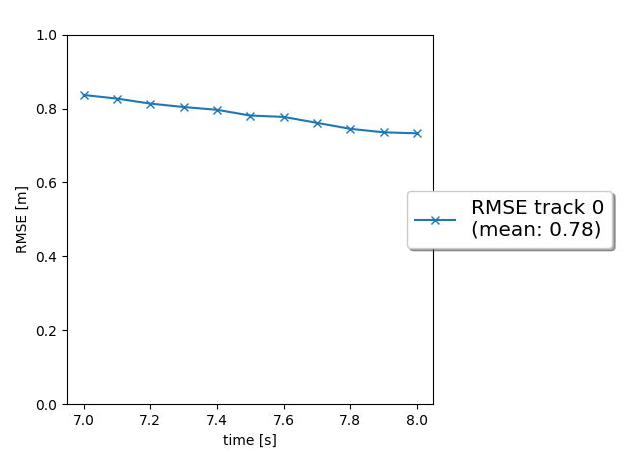
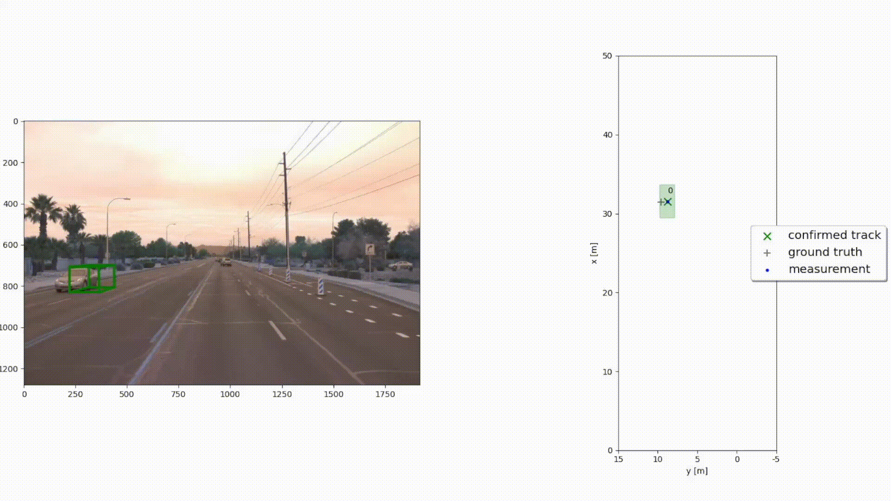
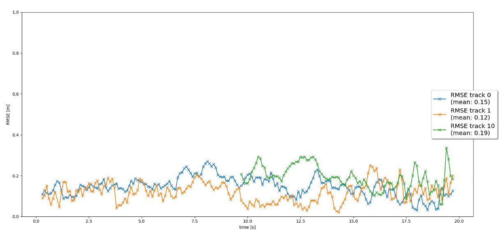
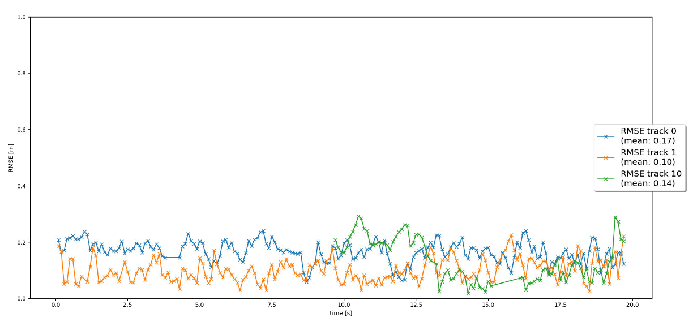

# **Kalman Filter Object Tracking**

## **Project Overview**
This project implements an Extended Kalman Filter (EKF) to track objects over time using a constant velocity motion model. The tracking system incorporates track management, data association, and sensor fusion with lidar and camera measurements. The evaluation is based on RMSE (Root Mean Square Error), and results are analyzed for tracking performance.

## **Installation**
To set up the project, ensure you have the following dependencies installed:

```bash
# Clone the repository
git clone https://github.com/your-username/kalman-tracking.git
cd kalman-tracking

# Create a virtual environment (optional but recommended)
python -m venv venv
source venv/bin/activate  # On Windows use: venv\Scripts\activate

# Install dependencies
pip install -r requirements.txt
```

## **Usage**
To run the tracker, execute:

```bash
python loop_over_dataset.py
```

This will process the dataset, apply the Kalman Filter, and generate RMSE plots.

## **Features & Implementation Steps**
### **1. Object Tracking with Kalman Filter**  
- Implemented EKF with appropriate system matrix **F** and process noise **Q** for a constant velocity motion model.
- Applied EKF to a single-target scenario with lidar-only measurements.
- Achieved a mean RMSE of **≤ 0.35**.




### **2. Track Management**  
- Implemented track initialization for unassigned measurements.
- Defined and implemented a **track score**.
- Implemented track states (**tentative**, **confirmed**).
- Deleted old tracks when they are no longer updated.
- **Expected Behavior:**
  - New track initializes automatically from unassigned measurements.
  - True track is confirmed quickly.
  - Track is deleted when it exits the visible range.
  - No track loss for a single continuous target.



### **3. Data Association**  
- Implemented **Nearest Neighbor Association**, including an **association matrix**.
- Implemented a method to return the nearest track and measurement for association.
- Applied a **gating method** with a chi-square distribution to reduce complexity.
- **Expected Behavior:**
  - Each measurement is used at most once, and each track is updated at most once.
  - No confirmed "ghost tracks" exist; tentative ghost tracks are deleted after several frames.



### **4. Sensor Fusion**  
- Implemented **camera measurements** with appropriate covariance matrix **R**.
- Implemented **nonlinear camera measurement model h(x)** and **Jacobian H**.
- Added a method to check if an object is within the **camera's field of view**.
- **Expected Behavior:**
  - Lidar updates are followed by camera updates in the tracking loop.
  - No confirmed ghost tracks or track losses.
  - The final **tracking visualization video** is generated.



## **Evaluation & Results**
- The tracking performance is evaluated using the **RMSE metric**.
- RMSE plots confirm at least **three tracks**, with two continuous tracks from **0s - 200s** without loss.
- The mean RMSE for these two tracks is **≤ 0.25**.

## **File Structure**
```
├── student/
│   ├── filter.py           # Kalman Filter implementation
│   ├── trackmanagement.py  # Track initialization, scoring, deletion
│   ├── association.py      # Data association with nearest neighbor
│   ├── measurements.py     # Sensor fusion with lidar & camera
│   ├── main.py             # Main execution script
│   ├── utils.py            # Helper functions
│   └── data/               # Input data files
├── results/
│   ├── rmse_plot.png           # Evaluation plots of Kalman Filter
│   ├── filter.gif              # Kalman Filter visualization
│   ├── track_management.gif    # Trackiing management visualization 
│   ├── track_management.png    # Evaluation plots of Tracking management
│   ├── association.gif         # Association visualiztion
│   ├── association_results.png # Evaluation plot of Association
│   ├── measurements.gif        # Measurement evaluation (sensor fusion with lidar and camera)
│   ├── measurements.png        # Evaluation plots of Measurements
├── README.md
├── requirements.txt        # Dependencies
```

## **Contributors**
- Lucas Elbert Suryana

## **License**
This project is open-source and licensed under the [MIT License](LICENSE).

---

Would you like any further modifications or additional details? 😊
