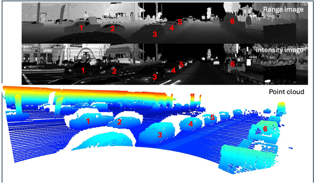

## Introduction

The goal of ID_S1_EX2 task is to display 6 examples of vehicles and to identify vehicle features that appear as a stable
feature on the mose vehicles. To achieve the goal, we use Open3D library to display the lidar-point cloud in a 3d
viewer. The results are displayed in the following figure. The figure shows three types of image: range image,
intensity, and point cloud. 
* The range image is displayed in the top row, 
* The intensity image is displayed in the middle row, and 
* The point cloud is displayed in the bottom row. 

The left column shows the point cloud of the vehicle from the
front view, the middle column shows the point cloud of the vehicle from the top view, and the right column shows the
point cloud of the vehicle from the side view.

## Vehicle Examples

From the figure, we can see six examples of vehicles. The vehicles are shown in the following table.

| Vehicle ID | Type  | Visibility | Position           |
|------------|-------|------------|--------------------|
| 1          | SUV   | Fully      | Opposite Direction |
| 2          | Sedan | Partially  | Opposite Direction |
| 3          | Sedan | Fully      | Opposite Direction |
| 4          | Sedan | Partially  | Opposite Direction |
| 5          | Sedan | Partially  | Opposite Direction |
| 6          | SUV   | Fully      | Same Direction     |

## Stable Vehicle Features
If the vehicle position is opposite to the camera, the left front fender is likely to have high reflectivity due to the vehicle's front light being close to it and facing the opposite direction. This is a stable feature observed in most vehicles. Other stable features include:
* Front windshield
* Headlights
* Rearview mirrors

## Range Image and Intensity Image Observations
* In the range image, real appearances of vehicles are not visible, but the shape of the vehicle is more visible. For windows, the range image shows a black region, indicating the windows are transparent to the lidar.
* In the intensity image, the reflectivity of the vehicle's surface is visible. The component of the vehicles is clearly visible. However, the shape of the vehicle is not too visible. Furthermore, part of the vehicles that are reflective (such as front lights) are more visible in the intensity image. 
